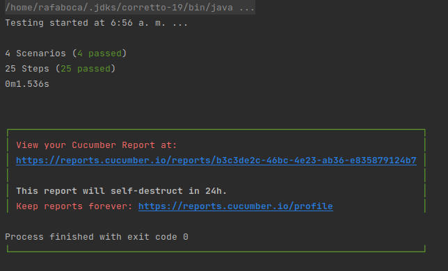

# Project of Api Test with maven cucumber
## requirements
- IntelliJ recomended as IDE
- Maven
- Docker and Docker compose

## Creation of project 

you can use maven archetype for generate an empty project with cucumber configured, using the next template you can create a project like that found in this repository

```
mvn archetype:generate                      \
   "-DarchetypeGroupId=io.cucumber"           \
   "-DarchetypeArtifactId=cucumber-archetype" \
   "-DarchetypeVersion=7.5.0"               \
   "-DgroupId=hellocucumber"                  \
   "-DartifactId=hellocucumber"               \
   "-Dpackage=hellocucumber"                  \
   "-Dversion=1.0.0-SNAPSHOT"                 \
   "-DinteractiveMode=false"
```
this template was on the [cucumber.io](https://cucumber.io/docs/guides/10-minute-tutorial/?lang=java)

for execute the request, the project are using [Uni-rest](http://kong.github.io/unirest-java/)

## Execute the test in local environment

before execute the test, is recommended clean the project with the command:
```
mvn clean
```
the test could be executed with the command:
```
mvn test
```
If the execution is succeeded, the terminal you could view the results



## CI on Jenkins
If you don't have server for CI you can use the docker executing  `docker-compose up` on the folder `JenkinsServer`
